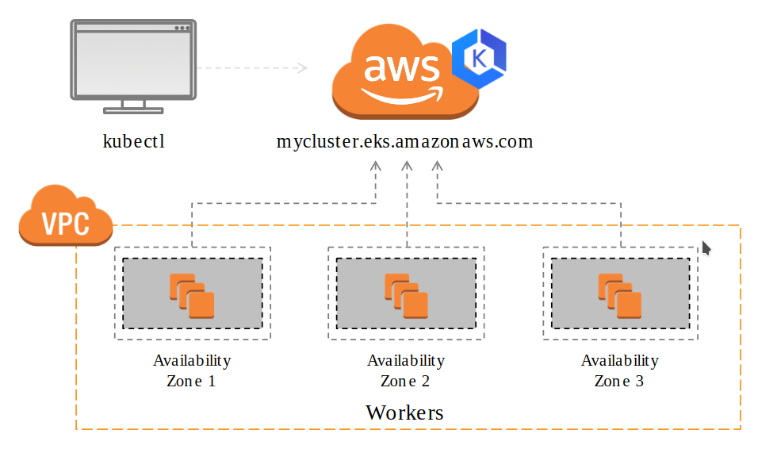
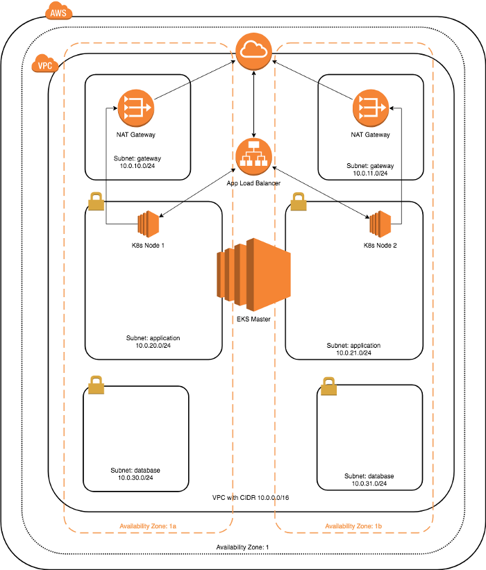
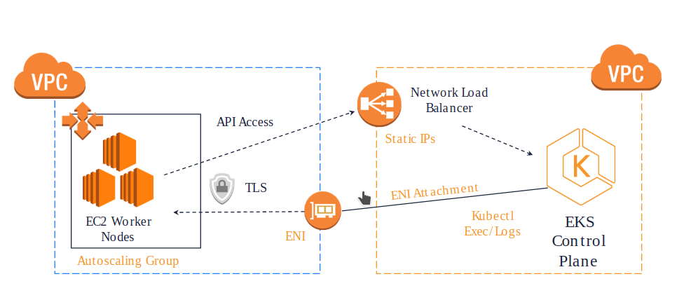

# Cloud Infrastructure Design for Balena


## Project Description and Requirements

You have been tasked to design the cloud infrastructure for a new service. The service is composed of multiple components, each of which comes packaged in a docker image.
The components are:

- ui
  - A user interface served as static files
  - image: acme/ui
  - domain: www.acme.com
  - port: 80/443
  - exposed to the internet: yes
- api
  - A stateless RESTful API server to which the UI connects to get data
  - image: acme/api
  - domain: api.acme.com
  - port: 443
  - exposed to the internet: yes
  - expected env vars:
    - POSTGRES_URL: url of the postgres instance
    - METRICS_URL: url of the prometheus instance
- db
  - A PostgreSQL database
  - port: 5432
  - exposed to the internet: no
- metrics
  - A prometheus container collecting metrics
  - port: 80
  - exposed to the internet: no

You are given full freedom to get this to production so use your expert judgement to decide how the deployment will look like and document why you made each technology and design choice. (e.g I chose to use RDS instead of running postgres directly to avoid dealing with persistent state in the k8s cluster).

At the very minimum your solution should include:

- A way to update all components with zero-downtime
- A way to easily scale the api and ui instances horizontally
- Isolating internal from external components
- Handling HTTPS termination
- A schedule for backups and a disaster recovery plan
- An overview of performance metrics that you'd collect from the system

The solution can be based on any cloud technology you deem fit for purpose.The solution should be sent as a zip file containing a `README.md` file describing your architecture and the reasoning behind your choices. It should also indicate potential shortcomings and how you would approach them, for example by cooperating with the development team.

## Design Decisions

Initially this project was started using `AWS Cloud Formation (CF)` but I wanted to take advantage of some of the features that `Terraform` brings especially with regard to testing and verifying.  Past experience with `CF` has not been as productive as I've found `Terraform` to be plus the added bonus of being cloud provider agnostic in terms of a single language, tool-set and supported by most of those major cloud providers.



I also decided to go ahead and utilize `AWS EKS` since it seems to have matured enough both on `AWS` and on `Terraform` which helped reduce the complexity a bit. Heavy utilization of `Terraform` with remote state/sync and `Kubernetes` also makes for an easier disaster recovery as building and tearing down parts or the whole infrastructure happen regularly during development.

Also initially the plan was to deploy `Postgres` as a service on `Kubernetes` but I wanted to take advantage of `Terraform` and given it would be one of the most critical peices of the application infrstructure, persistent and not stateless; it made more sense to me to take advantage of it as a managed service from `AWS`. Also since `Terraform` is being utilized, moving it to another cloud provider is much less work without.

## Overview of Infrastructure



The above diagram shows the overall design of the `AWS` infrastructure necessary to support a `Kubernetes` cluster for the given design specifications of this project.  The main thing to note is there is at least 1 `EC2` instance in each `Availability Zone` of which contain 3 subnets. 

## Terraform Project

Since `Kubernetes` automation helps make continuous integration and deployment easier, I decided to take advantage of `Terraform` for developing the infrastructure for the same reasons.  Also, `Terriform` makes trying things out, rolling back and tearing down very easy.  Another benefit is the ability to remotely store the current state of your `Terraform` project so team members can easily collaborate and your whole infrastructure design is continuously backed up.  For this project I've set and tested this, but since I was the only one working on it there was no need to keep syncing it remotely.  Turning this back on would be the first step (see the `state.tf` and just uncomment the whole block).  If the `awscli` is already setup then using `Terraform` is just a matter of installing/copying the binary to one of your executable `$PATH`.   You can run the following script and it will download, unpack, and move it to `/usr/local/bin`:

```bash
./scripts/install_terraform.sh
```

Then you can run `terraform init` and it should setup the project (including downloading service provider connectors).  Then run `terraform apply` and it will build out most of the required `AWS` infrastructure required (`Kubernetes` cluster) to support the services and deployment requirements of this project.

I setup the project to utilize the module functionality to help organize but also to make them more reusable for other projects where ever possible.  The network pieces are hard to decouple but the remaining major parts can be re-used with little adjustment.  


## Kubernetes Setup

If you don't have the `kubectl` binary installed or a version older than 1.13 you can do it either with a package manager like this (for `Ubuntu`):

```bash
sudo apt-get update && sudo apt-get install -y apt-transport-https
curl -s https://packages.cloud.google.com/apt/doc/apt-key.gpg | sudo apt-key add -
echo "deb https://apt.kubernetes.io/ kubernetes-xenial main" | sudo tee -a /etc/apt/sources.list.d/kubernetes.list
sudo apt-get update
sudo apt-get install -y kubectl
```

Or the more expedient way since it is just a binary to put in an executable path on your machine.  Just run this:

```bash
./scripts/install_kubectl.sh
```

Before we can connect to the cluster with `kubectl` and before any of the `EC2` nodes can communicate with the master, two commands need to be run.  I've added them as `bash` scripts in the scripts directory.  I wasn't able to get this to work as a `Terraform` resource and from what I found from documentation and searching, not many people have had luck either.  The first script to run, sets your `~/.kube/config` to the new cluster. 

```bash
./scripts/get_kube_config.sh
```

This is prompt you before overwriting your `~/.kube/config` so you can back it up first.  You can use the `aws eks update-kubeconfig`if you prefer, [which is recommended](https://docs.aws.amazon.com/cli/latest/reference/eks/update-kubeconfig.html) if you connect to more than one cluster.

The second script applies the IAM Role and Instance Profile which is used by `Kubernetes` to allow worker nodes to join the cluster.  This won't work if you haven't updated your kube config file yet.

```bash
./scripts/write_config_map.sh
```

Once this is run you can check the status of the nodes to see when they join the cluster and know when to proceed with the next part.

```bash
kubectl get nodes
# or
kubectl get nodes --watch
```


# Services Setup

 

This section focuses on getting the monitoring, metrics and database services setup.  To help with this another utility needs to be configured on the cluster called `helm`. It will help make deploying these services more automated and easier to roll back than manually applying `yaml` files for these critical services.

The first step is to get `helm` installed and configured. This requires having the binary on your machine like `kubectl` .  To get this installed and initialize it on the cluster do the following:

```bash
cd ./kube/
./helm_install_init.sh
```

This will download the `helm` binary, unpack it, move it to `/usr/local/bin` .  Then it will run `kubectl create -f monitor/rbac-config.yaml`  which fixes permissions to allow `helm` the permissions it needs.  Lastly it runs `helm init`.  You can also do this manually or adjust the script to point to your platform's version. You can also use their shell script to download and install the `helm` binary but you still need to to the other 2 steps.

```bash
curl https://raw.githubusercontent.com/helm/helm/master/scripts/get | bash
```

## Prometheus and Grafana

Now we can use `helm` to deploy the monitoring services and it also can be used to check for updates similar to how `apt` works for `Ubuntu`. To get started

```bash
cd ./monitor
./setup.sh
```

This sets up a persistent volume claim so `Prometheus` has a place to store the logs and since it will be setup with `AWS ELB` it can be setup for automatic snapshots and backups to `S3`.  This creates all the services and deployments in a `monitoring` name space and helps organize things.  To see what and how this is setup you can just check with `kubectl`:

```bash
kubectl get all -n monitoring
```

 


## Postgresql Clustered

Initial set this up with `Terraform` as an AWS managed database but wasn't sure how much control I would have over the monitoring and logging and even so it would have to be setup and used completely differently from the other services.  I also found a nice deployment `helm` chart that set this up clustered with scalability and [very easy setup](docs/prod-ready-postgres-kube.md).  It also would utilize `ELB`and allow for snapshotting for backups to `S3`.  To set this up, like the previous services, change to the database directory and run the setup.  __NOTE__: Before running the setup script, make sure to change the `ROOT_PASSWORD` and `REPLICATION_PASSWORD`.

```bash
cd ../database/
./setup.sh
```

There are additional notes in the script on how to test that the deployment worked but the `helm` script will output the same message.


# So Far



At this point we have 3 of the 6 deliverables setup and a good portion of the backup and disaster recover in place.  The final pieces will be to tie together what was created with `Terraform` to the apps with certificate management and HTTPS termination.  Then the design plan and implementation of the automated backup and disaster recovery plan.


## Load Balancing, Ingress and SSL/Cert Mgmt

There are [several options that will handle ingress](https://kubernetes.io/docs/concepts/services-networking/ingress-controllers/) but the most common one and for good reason is a `helm` packed deployment that handles both load balancing and `SSL` registration with Let's Encrypt.  The package or Chart can be [found here](https://github.com/jetstack/cert-manager).  Internal certificate management is handled by `AWS` and was setup with `Terraform` in the `Route53` provisioning.  I did also setup and tested another load balancer/ingress called [Traefik](https://github.com/containous/traefik) because I use it for my sites and container based web apps.  I hadn't tried it on a `Kubernetes` cluster before but was easy to get working [thanks to](https://hub.helm.sh/charts/stable/traefik) `helm`.


## Automated Backups and Disaster Recovery

One of the `Terraform` files in the `EKS` cluster module is named `backup.tf`and it sets up the Role, Policy and scheduling to pool all the snapshots into a central place to manage and monitor backups. The full list of capabilities can be [found here](./Backup_Intro.md). There still needs to be some tweaking after its setup (i.e. pointing to `S3` buckets and setting up encryption).  These seemed like steps that should be handled manually especially since a good backup system is fully tested including doing a few mock failure scenarios.

All `ELB` volumes that are used for persistent storage (DB, Metrics, etc) are created with snapshotting setup and get automatically added to the scheduling pool.  With `Terraform` it would be easy to setup another second layer where the backups are pushed to another Cloud Provider and/or to another region like the us-west.  


## Rolling Updates with Zero Downtime

To facilitate zero downtime while updating the deployed applications, Kubernetes Deployments are utilized.  Deployments use ReplicaSets as well as handle the rolling update feature of Kubernetes which has to be handled more manually with ReplicaSets alone.  This is mainly accomplished by declaring a new state of the Pods in the Deployment via a new/different tag to the Pod's image (i.e. `image: my-app:1.1.1` => `image: my-app:1.1.2`).   When the updated Deployment is applied, a rollout is automatically started and the status can checked via `kubectl rollout status deployment.v1.apps/my-deployment`.  If there is a problem that Kubernetes has, the Deployment doesn't go through and the previous Deployment is still running.  If the problem is with your app itself and you want to go back to the previous version, then just change the Deployment image tag back to the previous version and re-apply the Deployment.

There is also a feature of Kubernetes that will auto-scale Deployments based on load and other criteria that can be defined in your Deployments.  It can only be utilized with Deployments because of the dependency on 

> The Horizontal Pod Autoscaler automatically scales the number of pods in a replication controller, deployment or replica set based on observed CPU utilization (or, with [custom metrics](https://git.k8s.io/community/contributors/design-proposals/instrumentation/custom-metrics-api.md) support, on some other application-provided metrics). Note that Horizontal Pod Autoscaling does not apply to objects that can’t be scaled, for example, DaemonSets.
>
> The Horizontal Pod Autoscaler is implemented as a Kubernetes API resource and a controller. The resource determines the behavior of the controller. The controller periodically adjusts the number of replicas in a replication controller or deployment to match the observed average CPU utilization to the target specified by user.

In the HPA definition for a Deployment you can specify the metrics and conditions for the auto-scaler to monitor and scale accordingly.  With the above monitoring system (Prometheus-Grafana and metrics-server) setup, these defined metrics utilize the monitoring-pipeline that is discussed in the next section. 

## Performance Monitoring

In Kubernetes clusters monitoring falls into two pipelines, the core metrics pipeline and the monitoring pipeline.  Directly from the Kubernetes documentation they are summarized as:

> **core metrics pipeline** consisting of Kubelet, a resource estimator, a slimmed-down Heapster called metrics-server, and the API server serving the master metrics API. These metrics are used by core system components, such as scheduling logic (e.g. scheduler and horizontal pod autoscaling based on system metrics) and simple out-of-the-box UI components (e.g. `kubectl top`). This pipeline is not intended for integration with third-party monitoring systems.
>
> **monitoring pipeline** used for collecting various metrics from the system and exposing them to end-users, as well as to the Horizontal Pod Autoscaler (for custom metrics) and Infrastore via adapters. Users can choose from many monitoring system vendors, or run none at all. In open-source, Kubernetes will not ship with a monitoring pipeline, but third-party options will be easy to install. We expect that such pipelines will typically consist of a per-node agent and a cluster-level aggregator.

The deployment above of Prometheus with Grafanna was done using a `Chart` from `helm` but specifically one created by `CoreOS` because they pre-configured it to handle all of the **core metrics pipeline** and many of the most common metrics from the **monitoring pipeline**.  There is, however, the the need to instrument and monitor the apps and services that will be deployed to the cluster which I will discuss here what would be recommended.

To best describe how this would be done and how I tested it on the cluster built, I created an app and then the deployment `simple-api-*.yaml` files (found in `kube/apps/simple-test-api/`).  In there you find the pod, service, replication service, and deployment definitions.  The deployment is all that is needed now, but the others were there for testing. There is also 2 more the `ServiceMonitor` and the `HorizontalPodAutoscaler` definitions which utilizes monitoring pipeline that translates for Prometheus and the Horizontal Pod Autoscaler feature of Kubernetes.  This builds on top of the power of Deployments ability to auto-scale the same way they utilize ReplicaSets. Depending on the applications being deployed, there might be additional metrics as exposed from instrumenting the applications themselves.  These can be defined in the HPA for the app as either Object or External metric types.


## Summary of Deliverables

This is just a summary and checklist of the deliverables for this project.

- ✓A way to update all components with zero-downtime
  - Using Deployments with specific versions of images with instant rollback capabilities.
- ✓A way to easily scale the api and ui instances horizontally
  - Main function of the Kube Deployments which can be adjusted and applied, as well as the HPA component.
- ✓Isolating internal from external components
  - DB, Metrics, anything not `HTTP/HTTPS` run on private subnet.  Web and API on public subnet
- ✓Handling `HTTPS` termination
  - `AWS ALB` Ingress will do this and get SSL from let’s encrypt
- ✓A schedule for backups and a disaster recovery plan
  - List all ways each part is backed up (i.e. ELB snapshots to S3)
- ✓An overview of performance metrics that you'd collect from the system
  - Review the Prometheus setup from Videos and list these